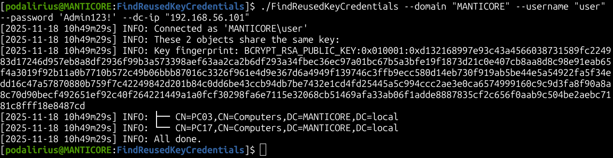
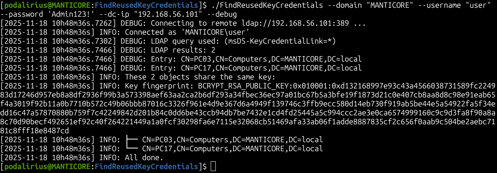
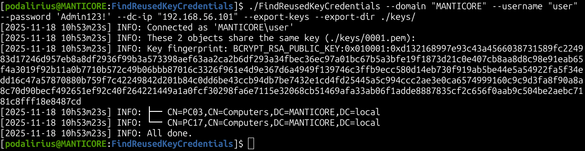
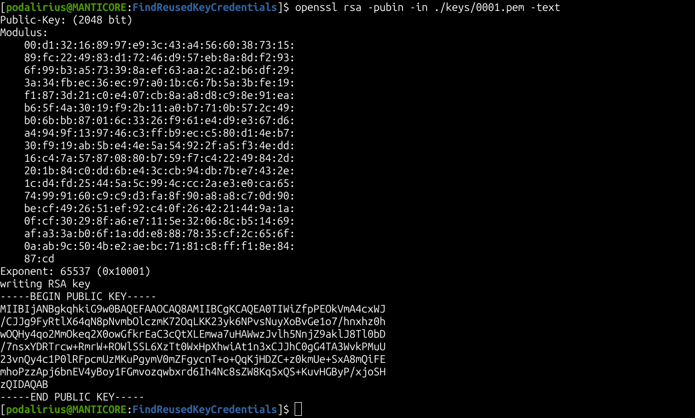

<p align="center">
      A cross-platform tool to find reused key credentials on multiple objects in Active Directory. 
      <br>
      <a href="https://github.com/p0dalirius/FindReusedKeyCredentials/actions/workflows/release.yaml" title="Build"></a>
      
      <a href="https://twitter.com/intent/follow?screen_name=podalirius_" title="Follow"></a>
      <a href="https://www.youtube.com/c/Podalirius_?sub_confirmation=1" title="Subscribe"></a>
      <br>
</p>

## Features

- [x] Connect to LDAP server and retrieve msDS-KeyCredentialLink data
- [x] Parse msDS-KeyCredentialLink data from a file
- [x] Export found RSA keys to PEM files
- [x] Identify and report reused key credentials in Active Directory

## Usage

```
$ ./FindReusedKeyCredentials -h
FindReusedKeyCredentials - by Remi GASCOU (Podalirius) @ TheManticoreProject - v1.0.0

Usage: FindReusedKeyCredentials [--quiet] [--debug] [--export-dir <string>] [--export] --domain <string> --username <string> [--password <string>] [--hashes <string>] [--dc-ip <string>] [--ldap-port <tcp port>] [--use-ldaps]

  -d, --debug                Debug mode. (default: false)
  -ed, --export-dir <string> Export the RSA keys to this folder. (default: "./keys/")
  -e, --export               Export the found RSA keys. (default: false)

  Authentication:
    -d, --domain <string>   Active Directory domain to authenticate to.
    -u, --username <string> User to authenticate as.
    -p, --password <string> Password to authenticate with. (default: "")
    -H, --hashes <string>   NT/LM hashes, format is LMhash:NThash. (default: "")

  LDAP Connection Settings:
    -dc, --dc-ip <string>       IP Address of the domain controller or KDC (Key Distribution Center) for Kerberos. If omitted, it will use the domain part (FQDN) specified in the identity parameter. (default: "")
    -lp, --ldap-port <tcp port> Port number to connect to LDAP server. (default: 389)
    -L, --use-ldaps             Use LDAPS instead of LDAP. (default: false)

```

## Demonstration

### Normal mode

```bash
./FindReusedKeyCredentials --domain "LAB.local" --username "Administrator" --password "Admin123!" --dc-ip "192.168.56.101"
```



### Debug mode

```bash
./FindReusedKeyCredentials --domain "LAB.local" --username "Administrator" --password "Admin123!" --dc-ip "192.168.56.101" --debug
```



### Normal mode with export keys

```bash
./FindReusedKeyCredentials --domain "LAB.local" --username "Administrator" --password "Admin123!" --dc-ip "192.168.56.101" --export-keys
```



```bash
openssl rsa -pubin -in ./keys/0001.pem -text -noout
```



## Contributing

Pull requests are welcome. Feel free to open an issue if you want to add other features.
